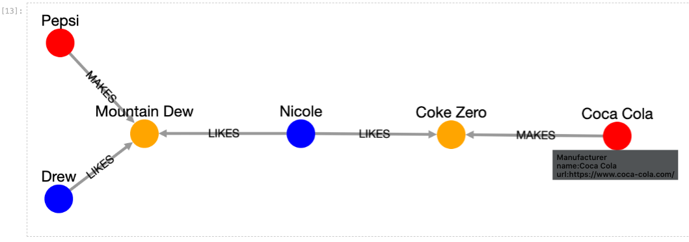

# neo4j-ipycytoscape

This repo demonstrates how to use the [ipycytoscape widget](https://github.com/QuantStack/ipycytoscape) to visualize a Neo4j subgraph with cytoscape.js in Jupyter Lab. It also demonstrated how to setup a local instance of the Neo4j graph database.

Example subgraph rendered in Jupyter Notebook.
<p align="center">

</p>

Colors and styles of nodes and relationships can be changed. By clicking on a node, a tooltip with the node properties is displayed. The layout can also be manually changed by dragging nodes to new positions. 

|Notebook|Description|
|:-------|:----------|
|[Neo4j_Example1](notebooks/Neo4j_Example1.ipynb)| Creates a small Neo4j graph locally and demonstrates how to display a Neo4j subgraph|
|[Neo4j_Example2](notebooks/Neo4j_Example2.ipynb)| Accesses the [COVID-19-Net Knowledge Graph](https://github.com/covid-19-net/covid-19-community) server and demonstrates how to display a Neo4j subgraph|

## Run Jupyter Lab locally
Follow the steps below to setup and run the example notebooks on Mac, Linux, or Windows.

------
Prerequisites: Miniconda3 (light-weight, preferred) or Anaconda3 and Mamba (faster than Conda)

* Install [Miniconda3](https://docs.conda.io/en/latest/miniconda.html)
* Update an existing miniconda3 installation: ```conda update conda```
* Install Mamba: ```conda install mamba -n base -c conda-forge```
* Install Git (if not installed): ```conda install git -n base -c anaconda```
------

**1. Clone this Git repository**

```
git clone https://github.com/sbl-sdsc/neo4j-ipycytoscape.git
cd neo4j-ipycytoscape
```

**2. Create a Conda environment**

The file `environment.yml` specifies the Python version and all packages required by the tutorial. 
```
mamba env create -f environment.yml
```

Activate the conda environment
```
conda activate neo4j-ipycytoscape
```

**3. Launch Jupyter Lab**
```
jupyter lab
```

Navigate to the [`notebooks`](notebooks) directory to run the example Jupyter Notebooks.

**4. Deactivate the Conda environment**

When you are finished, deactivate the conda environment or close the terminal window.

```
conda deactivate
```

------
> To remove the Conda environment, run ```conda env remove -n neo4j-ipycytoscape```
------


## Run Jupyter Lab on SDSC Expanse

[Expanse](https://www.sdsc.edu/support/user_guides/expanse.html) is an National Science Foundation (NSF)-funded supercomputer at the [San Diego Supercomputer Center](https://www.sdsc.edu/) at UC San Diego. Free allocations are available for academic researchers. A trial allocation can be obtained by contacting consult@sdsc.edu or a full allocation by applying through the [ACCESS progam](https://allocations.access-ci.org/prepare-requests-overview).


1. Log into the [Expanse Portal](https://portal.expanse.sdsc.edu/) with your ACCESS credentials.
    
2. Open a Terminal Window ("Shell Access") through the [Expanse Portal](https://portal.expanse.sdsc.edu/).

3. Clone the Git repository neo4j-ipycytoscape
```
git clone https://github.com/sbl-sdsc/neo4j-ipycytoscape.git
```

4. Change into the neo4j-ipycytoscape directory
```
cd neo4j-ipycytoscape
```

5. Launch Jupyter Lab using the Galyleo

    Fill in the your project account number in the command below. Galyleo will generate a URL for your Jupyter Lab session and create a Conda environment specified by the environment.yml file.
    
```
galyleo launch --account <account_number> --partition shared --cpus 1 --memory 8 --time-limit 00:30:00 --conda-env neo4j-ipycytoscape --conda-yml environment.yml --mamba
```

> Note, before you use Galyleo the first time, append ```export PATH="/cm/shared/apps/sdsc/galyleo:${PATH}"``` to the ```.bashrc``` file in your home directory then and run ```source ./.bashrc```.

6. Open a new tab in your web browser and paste the Jupyter Lab URL.

    Wait until Jupyter Lab launches. This may take several minutes.

> You should see the Satellite Reserver Proxy Servive page launch in your browser.

8. Run the example notebooks

    Navigate to the [`notebooks`](notebooks) directory to run the example Jupyter Notebooks.
   
9. Shutdown Jupyter Lab
   
    From the file menu select ```Shutdown``` to terminate the process.
   
> If you do not shutdown Jupyter Lab, the process will continue running and use up allocated resources.


## Citation
Peter W. Rose, David Valentine, Ilya Zaslavsky, COVID-19-Net: Integrating Health, Pathogen and Environmental Data into a Knowledge Graph for Case Tracking, Analysis, and Forecasting. Available online: https://github.com/covid-19-net/covid-19-community (2020).

## Funding
The Neo4j graph visualization for ipycytoscape is in part supported by the National Science Foundation under Award Numbers:

**NSF Convergence Accelerator Phase I (RAISE):** Knowledge Open Network Queries for Research (KONQUER) ([1937136](https://www.nsf.gov/awardsearch/showAward?AWD_ID=1937136))

**NSF RAPID:** COVID-19-Net: Integrating Health, Pathogen and Environmental Data into a Knowledge Graph for Case Tracking, Analysis, and Forecasting ([2028411](https://www.nsf.gov/awardsearch/showAward?AWD_ID=2028411))
